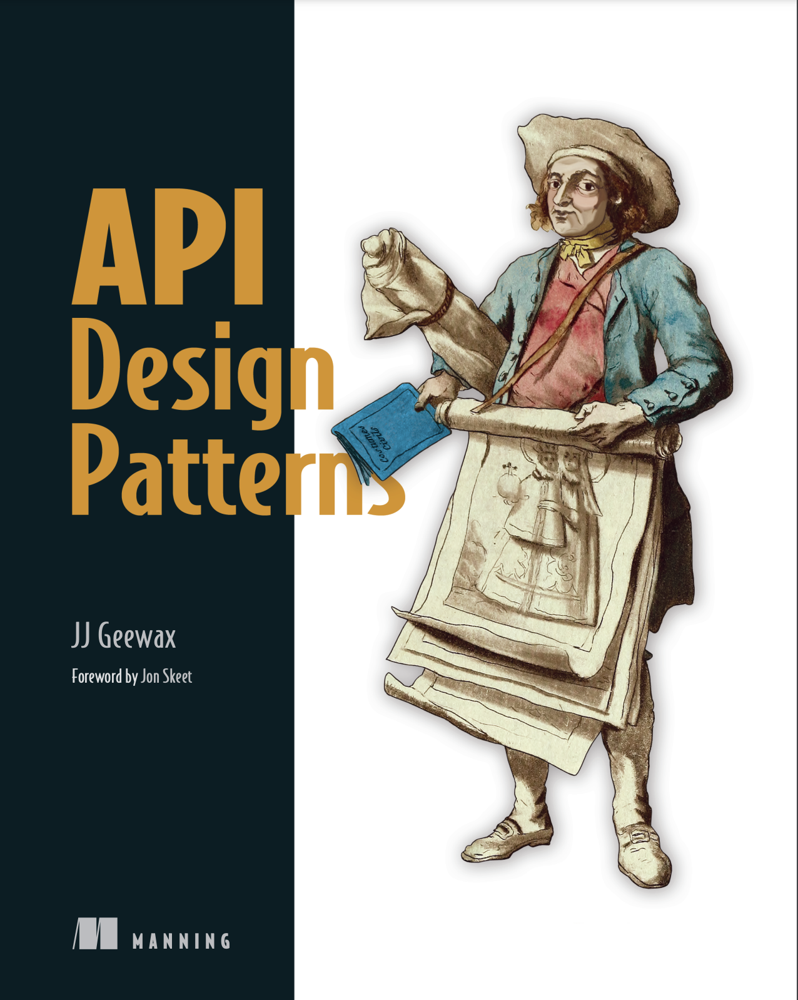

# 《API Design Patterns》中文翻译

## 资源链接
> + **[在线浏览(推荐)](https://evan-ysj.github.io/APIDesignPatternsChinese)**
> + [PDF格式英文版下载](public/APIDesignPatterns.pdf)
> + [Google API Design Guide (中文)](https://google-cloud.gitbook.io/api-design-guide/)
> + [Google AIP (API Improvement Proposals)](https://google.aip.dev/)

## 简介
《API Design Patterns》出版自2021年，分25个专题总结了通用的API设计模式，并详细阐述了每个模式的最佳实践设计思路。通常，我们在进行接口设计时没有所谓的标准解决方案，需要根据实际情况进行取舍。作者在讲解每个设计模式时列举了大量实际生产中的案例，对不同的解决方案深入剖析各自的优缺点。对于在工作中有大量系统设计和接口编写需求的同学，一定会从本书获益良多。另外，本书也适合尚未踏入工作岗位但有一定接口编程基础的在校生。书中大量的例举分析有助于同学们提前对工业代码有一定的了解。不过本书部分内容对于学生来讲或许稍显抽象，我会使用尽量通俗的措辞进行翻译方便读者理解。

本书作者JJ Geewax曾在Google任职Principle Software Engineer，专注于实时支付系统、云基础设施和API设计。他还是《Google Cloud Platform in Action》一书的作者，同时也是AIP.dev的创始人之一。（AIP.dev是在Google启动的一个面向整个行业的API设计标准协作项目）

## 目录

1. __简介__
	1. [什么是API](src/1.introduction/1.introduction-to-apis.md)
	2. [什么是API设计模式](src/1.introduction/2.introduction-to-api-design-patterns.md)
2. __设计原则__
    1. [命名](src/2.design-principles/1.naming.md)
    2. [资源规模和层级](src/2.design-principles/2.resource-scope-and-hierarchy.md)
    3. [数据类型和默认值](src/2.design-principles/3.data-types-and-defaults.md)
2. __基础篇__
    1. [资源识别](src/3.fundamentals/1.resource-identification.md)
    2. [标准方法](src/3.fundamentals/2.standard-methods.md)
    3. [部分更新和检索](src/3.fundamentals/3.partial-updates-and-retrievals.md)
    4. [自定义方法](src/3.fundamentals/4.custom-methods.md)
    5. [耗时操作](src/3.fundamentals/5.long-running-operations.md)
    6. [可重复运行任务](src/3.fundamentals/6.rerunnable-jobs.md)
